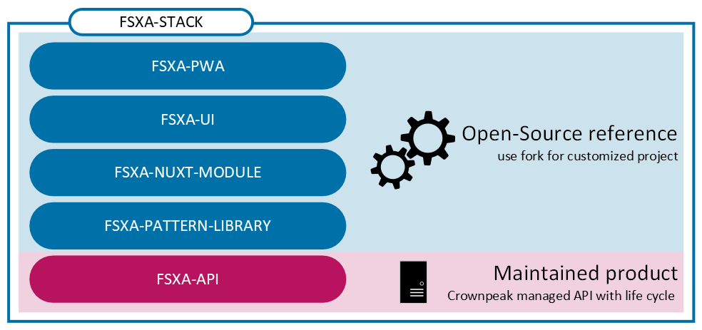

= ❗Important Notice

This repository has been deprecated and is no longer actively maintained. We recommend you use the https://github.com/e-Spirit/crownpeak-pwa-template[crownpeak-pwa-template] instead.

= FSXA-PWA

The FSXA-PWA is an example project and can be used as basis for developing your own PWA
in the context of the FirstSpirit Experience Accelerator.

== About the FSXA

The FirstSpirit Experience Accelerator (FSXA) is the hybrid solution of a digital
experience platform, combining a headless approach with enterprise capabilities.
The FSXA stack consists of five repositories:

* https://github.com/e-Spirit/fsxa-pwa[FSXA-PWA]
* https://github.com/e-Spirit/fsxa-ui[FSXA-UI / Component Library]
* https://github.com/e-Spirit/fsxa-nuxt-module[FSXA-Nuxt-Module]
* https://github.com/e-Spirit/fsxa-pattern-library[FSXA-Pattern-Library]
* https://github.com/e-Spirit/fsxa-api[FSXA-API]

While the FSXA-API is a maintained product with a life cycle, the FSXA-PWA, FSXA-UI, FSXA-Nuxt-Module and FSXA-Pattern-Library are merely best practices examples how a project could be set up and integrate the FSXA-API.
The latter repositories can be forked to speed up the startup time of a frontend project or to understand how common use cases can be solved in headless projects.
The code itself can therefore also be used as documentation of best practices.

The following image illustrates the product cut:

> **_Attention_**
> Since the reference implementation does not represent a maintained product, we do not guarantee support for its use.

== Documentation

If you are interested in the FSXA check this link:https://docs.e-spirit.com/module/fsxa/overview/benefits-hybrid/index.html[Overview].

Developer documentation for the FSXA-PWA's vue components is part of the link:https://github.com/e-Spirit/fsxa-ui[FSXA-UI repository].

=== Table of contents

. xref:docs/modules/ROOT/pages/Introduction.adoc[Introduction]
.. xref:docs/modules/ROOT/pages/Introduction.adoc#general[General]
.. xref:docs/modules/ROOT/pages/Introduction.adoc#projects-used[Projects used]
.. xref:docs/modules/ROOT/pages/Introduction.adoc#architecture[Architecture]
.. xref:docs/modules/ROOT/pages/Introduction.adoc#deployment[Deployment]
. xref:docs/modules/ROOT/pages/GettingStarted.adoc[Getting Started]
.. xref:docs/modules/ROOT/pages/GettingStarted/MyFirstTemplate.adoc[My First Template]
.. xref:docs/modules/ROOT/pages/GettingStarted/CustomCSS.adoc[Adding CSS]
.. xref:docs/modules/ROOT/pages/GettingStarted/ChangingtheAppLayout.adoc[Changing the App Layout]
.. xref:docs/modules/ROOT/pages/GettingStarted/UseExistingProject.adoc[Using an Existing Project With the FSXA PWA]
. xref:docs/modules/ROOT/pages/Configuration.adoc[Configuration]
.. xref:docs/modules/ROOT/pages/Configuration.adoc#env-file[.env File]
.. xref:docs/modules/ROOT/pages/Configuration.adoc#fsxa-config[fsxa.config]
. xref:docs/modules/ROOT/pages/VuexStore.adoc[The Vuex Store]
. xref:docs/modules/ROOT/pages/DevMode.adoc[DevMode]
. xref:docs/modules/ROOT/pages/Routing.adoc[Routing]
. xref:docs/modules/ROOT/pages/Richtext.adoc[Working with Richtext]
. xref:docs/modules/ROOT/pages/css.adoc[Custom CSS]
.. xref:docs/modules/ROOT/pages/css/Component.adoc[Adding Custom CSS to your Component]
.. xref:docs/modules/ROOT/pages/css/RemovingTailwind.adoc[Removing Tailwind CSS for your Project]
. xref:docs/modules/ROOT/pages/ProjectProperties.adoc[ProjectProperties]
. xref:docs/modules/ROOT/pages/WorkingWithImages.adoc[Working with Images]
.. xref:docs/modules/ROOT/pages/WorkingWithImages.adoc#introduction[Introduction]
.. xref:docs/modules/ROOT/pages/WorkingWithImages.adoc#working-with-caas[Working with CaaS]
.. xref:docs/modules/ROOT/pages/WorkingWithImages.adoc#resolutions-in-firstspirit[Resolutions in FirstSpirit]
.. xref:docs/modules/ROOT/pages/WorkingWithImages.adoc#responsiveness[Responsiveness]
.. xref:docs/modules/ROOT/pages/WorkingWithImages.adoc#lazy-loading[Lazy Loading]
.. xref:docs/modules/ROOT/pages/WorkingWithImages.adoc#sourcesets[SourceSets]
. xref:docs/modules/ROOT/pages/Caching.adoc[Caching]
. xref:docs/modules/ROOT/pages/SSR.adoc[Server Side Rendering (SSR)]
. xref:docs/modules/ROOT/pages/RemovingPresets.adoc[Removing Presets]
. xref:docs/modules/ROOT/pages/components.adoc[Base Components]
.. xref:docs/modules/ROOT/pages/components/FSXABaseComponent.adoc[FSXABaseComponent]
.. xref:docs/modules/ROOT/pages/components/FSXABaseLayout.adoc[FSXABaseLayout]
.. xref:docs/modules/ROOT/pages/components/FSXABaseSection.adoc[FSXABaseSection]
.. xref:docs/modules/ROOT/pages/components/FSXABaseRichTextElement.adoc[FSXABaseRichTextElement]
.. xref:docs/modules/ROOT/pages/components/FSXABaseAppLayout.adoc[FSXABaseAppLayout]
. xref:docs/modules/ROOT/pages/components/FSXARenderContentElement.adoc[Render Content Element]
. xref:docs/modules/ROOT/pages/components/FSXADisplayHiddenSectionElement.adoc[Display Hidden Section Element]
. xref:docs/modules/ROOT/pages/Debugging.adoc[Debugging]
. xref:docs/modules/ROOT/pages/advanced.adoc[Advanced]
.. xref:docs/modules/ROOT/pages/advanced/TPP-Snap.adoc[TPP-Snap]
... xref:docs/modules/ROOT/pages/advanced/TPP-Snap.adoc#nested-elements[Nested Elements]
... xref:docs/modules/ROOT/pages/advanced/TPP-Snap.adoc#inline-editing[Inline-Editing]
.. xref:docs/modules/ROOT/pages/custom-api-routes.adoc[Custom API Routes]
... xref:docs/modules/ROOT/pages/advanced/custom-api-routes/CustomSitemap.adoc[Example 1: Custom Sitemap]
... xref:docs/modules/ROOT/pages/advanced/custom-api-routes/AccessingOtherProjects.adoc[Example 2:Accessing other FS-Projects]
... xref:docs/modules/ROOT/pages/advanced/custom-api-routes/SendingMails.adoc[Example 3: Sending Mails]
.. xref:docs/modules/ROOT/pages/advanced/SEO.adoc[SEO]
.. xref:docs/modules/ROOT/pages/advanced/ProxyConfiguration.adoc[Proxy Configuration]
.. xref:docs/modules/ROOT/pages/advanced/CircularReferences.adoc[Circular References]
.. xref:docs/modules/ROOT/pages/advanced/DeploymentProtection.adoc[Protecting Deployments]

== Legal Notices

FSXA-PWA is an example solution of http://www.e-spirit.com[Crownpeak Technology GmbH], Dortmund, Germany.
The FSXA-PWA is subject to the Apache-2.0 license.

== Disclaimer

This document is provided for information purposes only.
Crownpeak Technology may change the contents hereof without notice.
This document is not warranted to be error-free, nor subject to any
other warranties or conditions, whether expressed orally or
implied in law, including implied warranties and conditions of
merchantability or fitness for a particular purpose. Crownpeak Technology
specifically disclaims any liability with respect to this document
and no contractual obligations are formed either directly or
indirectly by this document. The technologies, functionality, services,
and processes described herein are subject to change without notice.