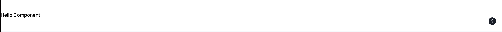

# FSXA-PWA

The FSXA-PWA is an example project and can be used as basis for developing your own PWA
in the context of the FirstSpirit Experience Accelerator.

### About the FSXA

The FirstSpirit Experience Accelerator (FSXA) is the hybrid solution of a digital
experience platform, combining a headless approach with enterprise capabilities.
If you are interested in the FSXA check this
[Overview](https://docs.e-spirit.com/module/fsxa/overview/benefits-hybrid/index.html). You can order
a demo [online](https://www.e-spirit.com/us/specialpages/forms/on-demand-demo/).

## Getting Started

This chapter describes how to set up the project and complete the first steps.

### Requirements

- [node](https://nodejs.org/en/) - latest LTS Version: 14.15.5.
- A text editor - like [VS Code](https://code.visualstudio.com/) with the [Vetur](https://marketplace.visualstudio.com/items?itemName=octref.vetur) plugin.
- A terminal - like VS Code's integrated [terminal](https://code.visualstudio.com/docs/editor/integrated-terminal)
- [Git](https://git-scm.com/) - latest major version: > 2.

### Setting up the project

1. Open the terminal and if needed, navigate to your preferred directory where the project should be saved.

2. Clone the project using the terminal command `git clone https://github.com/e-Spirit/fsxa-pwa.git`. The project should be downloaded into a folder called `fsxa-pwa`.

3. Navigate to the newly created folder with `cd fsxa-pwa`

4. Copy the existing `.env.template` file and paste it with the new name `.env` or simply run the command `cp .env.template .env`.

5. The .env file must contain all the information you need to access your own system. You can get this information from your contact at e-Spirit AG. By default, this file is located in the `.gitignore` and is therefore not persisted. Each required attribute is explained briefly, for a more detailed description please check the [configuration page](TODO).

6. To install the needed dependencies run the command `npm install`.

7. After all dependencies are installed, you can start a local development server with `npm run dev`.

8. After the server is started, it can be accessed at http://localhost:3000 in your browser.

### Writing components

In this section we will be exploring how to go about implementing a missing Teaser section.

When you go to the home page in [development mode](./docs/DevMode.md), you will see that one component is missing.


This infobox tells us that the app expects a component of type `Section`. We can also see that the key of this missing section is `teaser`.

In the `fsxa.config.ts` file we can see that our section components are located in `~/components/fsxa/sections`.
That's where you want to create a new file for the component.

Make sure, that you name the file just like the key that is required. In our case it is `teaser` so we name our new file `Teaser.tsx`.

Next we need to import two classes that are required to define our new component:

```typescript jsx
import Component from 'vue-class-component'
import { FSXABaseSection } from 'fsxa-pattern-library'
```

With this we can start writing our class.

```typescript jsx
@Component
class TeaserSection extends FSXABaseSection<{}>{
  
}
```

This class expects us to implement `render` function. This function describes which HTML will be displayed in our component.
To keep things simple for now we will write just a simple `render` function to see if our component is recognized.

```typescript jsx
render() {
  return <div>Hello Component</div>
}
```

To wrap things up we need to export our class.

```typescript jsx
export default TeaserSection
```

In the end our `Teaser.tsx` should look something like this:

```typescript jsx
import Component from 'vue-class-component'
import { FSXABaseSection } from 'fsxa-pattern-library'

@Component
class TeaserSection extends FSXABaseSection<{}> {
  render() {
    return <div>Hello Component</div>
  }
}

export default TeaserSection
```

When we go back to the browser, instead of the infobox we should see our component.



Our component is recognized correctly. But we still do not display the data from the CaaS in our component.
For that we hover over our component and click on the appearing question mark on the right side.


This shows us the data available to display.
For the first example we want to display the `st_jumbo_headline`.

For this we create an interface in our component and define the name of the attribute and its type.

```typescript
interface Payload {
  st_jumbo_headline: string
}
```

We update the use of the `FSXABaseSection` with our new payload: `class TeaserSection extends FSXABaseSection<Payload>`
and use the `st_jumbo_headline` in our `render` function.

````typescript jsx
render() {
    return <div>Headline: {this.payload.st_jumbo_headline}</div>
  }
````

Every attribute in our payload is accessible via `this.payload`

The result should look like this:


Next we want to continue to implement our payload interface.
For some objects we use interfaces from the [FSXA-Api](https://github.com/e-Spirit/fsxa-api), so we also have to import them.

```typescript
import { Image, RichTextElement } from 'fsxa-api'
```

The final interface looks like this:

```typescript
interface Payload {
  st_headline: RichTextElement[]
  st_jumbo_headline: string
  st_kicker: string
  st_picture?: Image
  st_picture_alt: string | null
  st_text: RichTextElement[]
  st_button?: {
    data: {
      lt_button_text: string
      lt_internal: {
        referenceId: string
        referenceType: string
      }
    }
  }
}
```

Note that attributes followed by a question mark are optional.

In order to display all this information, we can use a component from the [fsxa-ui](https://github.com/e-Spirit/fsxa-ui/).
First we need to import it. It is located under Sections in the fsxa-ui.

```typescript
import { Sections } from 'fsxa-ui'
```

Since we are using richtext we also need to import FSXARichText from the [fsxa-pattern-library](https://github.com/e-Spirit/fsxa-pattern-library)

```typescript
import { FSXABaseSection, FSXARichText } from 'fsxa-pattern-library'
```

And then we can use them in our `render` function:

```typescript jsx
render() {
    return (
      <Sections.TeaserSection
        headline={(<FSXARichText content={this.payload.st_headline} />) as any}
        kicker={this.payload.st_kicker}
        text={(<FSXARichText content={this.payload.st_text} />) as any}
        buttonText={this.payload.st_button?.data.lt_button_text}
        onButtonClick={() =>
          this.triggerRouteChange({
            pageId: this.payload.st_button?.data.lt_internal.referenceId
          })
        }
        media={
          this.payload.st_picture
            ? {
                type: 'image',
                src: this.payload.st_picture.resolutions.ORIGINAL.url,
                resolutions: this.payload.st_picture.resolutions,
                previewId: this.payload.st_picture.previewId
              }
            : undefined
        }
      />
    )
  }
```

Finally, we can name our component. We do this in the `@Component` annotation.

```typescript jsx
@Component({
  name: 'TeaserSection'
})
```

The final `Teaser.tsx` file looks like this:

```typescript jsx
import Component from 'vue-class-component'
import { FSXABaseSection, FSXARichText } from 'fsxa-pattern-library'
import { Sections } from 'fsxa-ui'
import { Image, RichTextElement } from 'fsxa-api'

interface Payload {
  st_headline: RichTextElement[]
  st_jumbo_headline: string
  st_kicker: string
  st_picture?: Image
  st_picture_alt: string | null
  st_text: RichTextElement[]
  st_button?: {
    data: {
      lt_button_text: string
      lt_internal: {
        referenceId: string
        referenceType: string
      }
    }
  }
}

@Component({
  name: 'TeaserSection'
})
class TeaserSection extends FSXABaseSection<Payload> {
  render() {
    return (
      <Sections.TeaserSection
        headline={(<FSXARichText content={this.payload.st_headline} />) as any}
        kicker={this.payload.st_kicker}
        text={(<FSXARichText content={this.payload.st_text} />) as any}
        buttonText={this.payload.st_button?.data.lt_button_text}
        onButtonClick={() =>
          this.triggerRouteChange({
            pageId: this.payload.st_button?.data.lt_internal.referenceId
          })
        }
        media={
          this.payload.st_picture
            ? {
                type: 'image',
                src: this.payload.st_picture.resolutions.ORIGINAL.url,
                resolutions: this.payload.st_picture.resolutions,
                previewId: this.payload.st_picture.previewId
              }
            : undefined
        }
      />
    )
  }
}

export default TeaserSection
```

Here you can see the result.


## Legal Notices

FSXA-PWA is a product of [e-Spirit AG](http://www.e-spirit.com), Dortmund, Germany.
The FSXA-PWA is subject to the Apache-2.0 license.

## Disclaimer

This document is provided for information purposes only.
e-Spirit may change the contents hereof without notice.
This document is not warranted to be error-free, nor subject to any
other warranties or conditions, whether expressed orally or
implied in law, including implied warranties and conditions of
merchantability or fitness for a particular purpose. e-Spirit
specifically disclaims any liability with respect to this document
and no contractual obligations are formed either directly or
indirectly by this document. The technologies, functionality, services,
and processes described herein are subject to change without notice.
