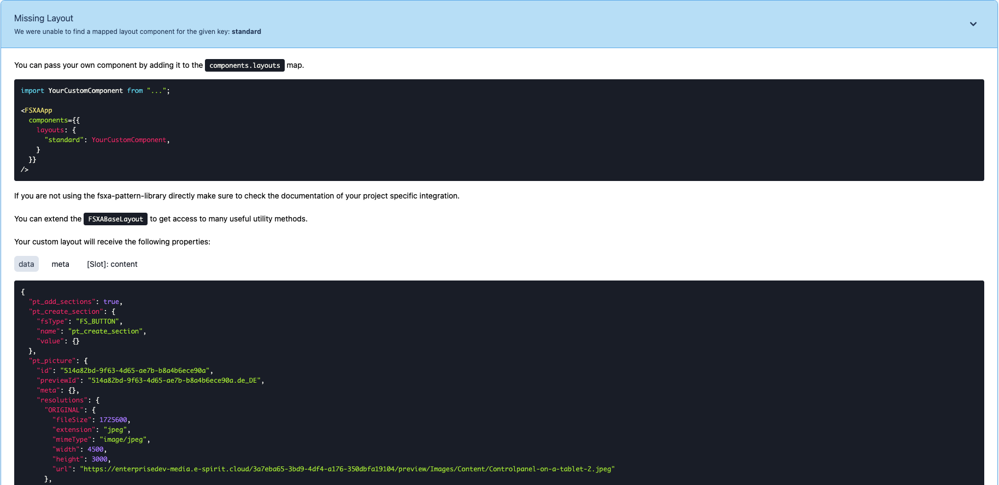
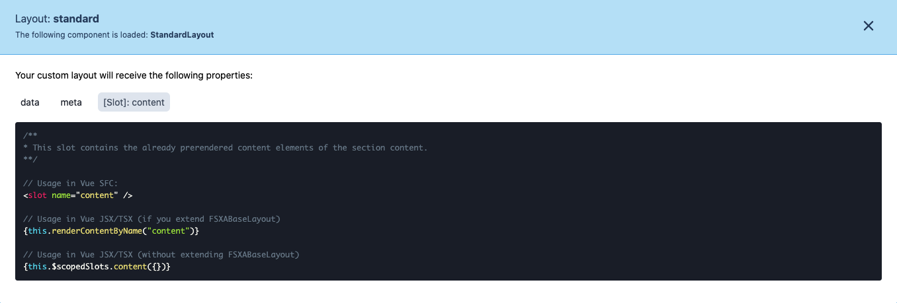
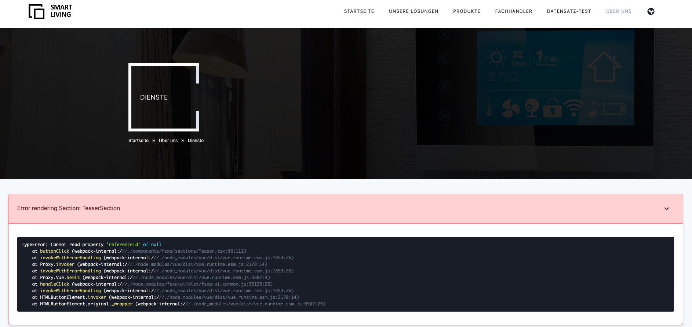

[<< Back to Index](./index.md)

# Development Mode

1. [Introduction](#introduction)
2. [Missing Components](#missing-components)
3. [Info Box](#info-box)
    * [Data/Payload](#data/payload)
    * [Meta](#meta)
    * [Slots](#slots)
4. [Errors](#Errors)

## Introduction

The FSXA-PWA features a development mode that helps you to easily map the content coming from the CaaS to your components.

To enable the development mode, the variable `devMode` must be set to `true` in the `fsxa.config.ts` file. Be aware that you have to restart the server when you change anything in this file. This file is also checked into git. So be sure to change the variable back to `false` before deploying to production.

## Missing Components

If you are in development mode and a component on the page has not been developed yet, you will get an info box which shows exactly which component is missing and what information can be addressed.



The `components` map can be found in the `fsxa.config.ts` in the root directory of your project.

## Info box

If you have already implemented a component, you will see a question mark icon when hovering over the element.


Clicking on this question mark will provide you with more information about which component is being displayed and what data is available.

### Data/Payload

This tab shows you all of the data that is available in the scope of this component. The data is defined by the FirstSpirit Template used to describe the current section or layout.


### Meta

This tab may contain information about the route, the FirstSpirit database scheme, entity types, previewId and other FirstSpirit related meta information.


### Slots

This tab only appears on layout components. It tells you which slots of your layout component are being used. You can control where you render the slot but you will get prerendered content passed into it. If for example you have a layout with two named slots, `header` and `content` the following would be an example of how you would render the slots in your component.



SFC example

```vue
<template>
    <div class="header">
        <slot name="header" />
    </div>
    <div class="content">
        <slot name="content" />
    </div>
</template>
```

TSX examples

If you don't extend [FSXABaseLayout](components/FSXABaseLayout.md)

```typescript jsx
render(){
    return(
        <div class="header">
            {this.$scopedSlots.header}
        </div>
        <div class="content">
            {this.$scopedSlots.content}
        </div>
    )
}
```

If you extend [FSXABaseLayout](components/FSXABaseLayout.md)

```typescript jsx
class MyComponent extends <FSXABaseLayout>{
    render(){
        return(
            <div class="header">
                {this.renderContentByName("header")}
            </div>
            <div class="content">
                {this.renderContentByName("content")}
            </div>
        )
    }
}
```

For more information on slots, check out the [Vue.js documentation](https://vuejs.org/v2/guide/components-slots.html)

## Errors

In case an error occurs within one of your components. It will get replaced by an error box to aid you in finding the cause as quickly as possible. This box displays the stack trace and takes the position of your component on the screen.


