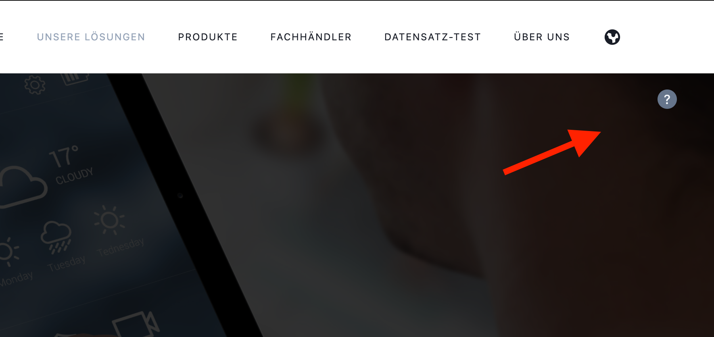
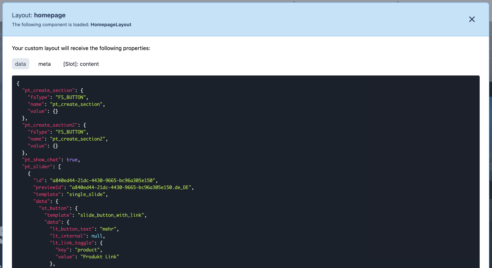
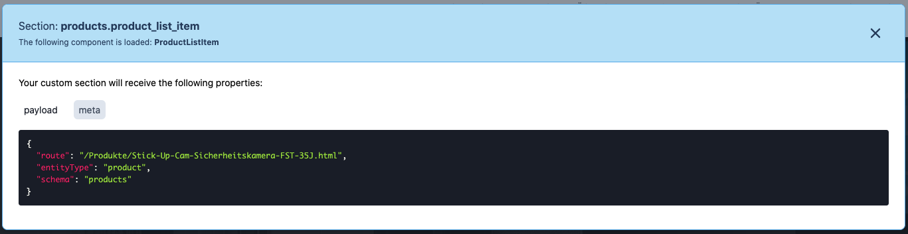
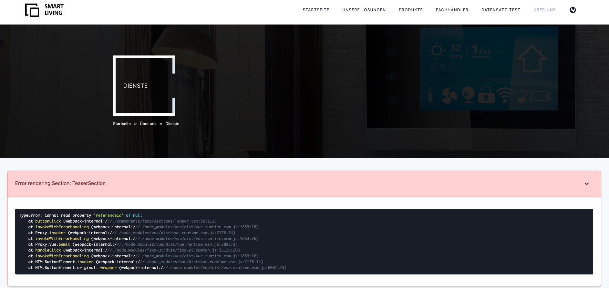

# Development Mode

[<< Back to index](index.md)

1. [Introduction](#introduction)
2. [Missing Components](#missing-components)
3. [Info Box](#info-box)
    * [Data/Payload](#data/payload)
    * [Meta](#meta)
    * [Slots](#slots)
4. [Errors](#Errors)

## Introduction

The FSXA-PWA features a development mode that helps you to easily map the content coming from the CaaS to your components.

To enable the development mode, the variable `devMode` must be set to `true` in the `fsxa.config.ts` file. Be aware that you have to restart the server when you change anything in this file. This file is also checked into git. So be sure to change the variable back to `false` before deploying to production.

## Missing Components

If you are in development mode and a component on the page has not been developed yet, you will get an info box which shows exactly which component is missing and what information can be addressed.

## Info box

If you have already implemented a component, you will see a question mark icon when hovering over the element.

Clicking on this question mark will provide you with more information about which component is being displayed and what data is available.

### Data/Payload

This tab shows you all of the data that is available in the scope of this component.

### Meta

This tab sometimes contains information about the route, the FirstSpirit database scheme and entity types, previewId

### Slots

This tab contains all the content that is passed into slots. Slots are a powerful way to customize your components. They allow for parts of the html to be defined by the consumer of a component.

## Errors

In case an error occurs within one of your components. It will get replaced by an error box to aid you in finding the cause as quickly as possible. This box displays the stack trace and takes the position of your component on the screen.

