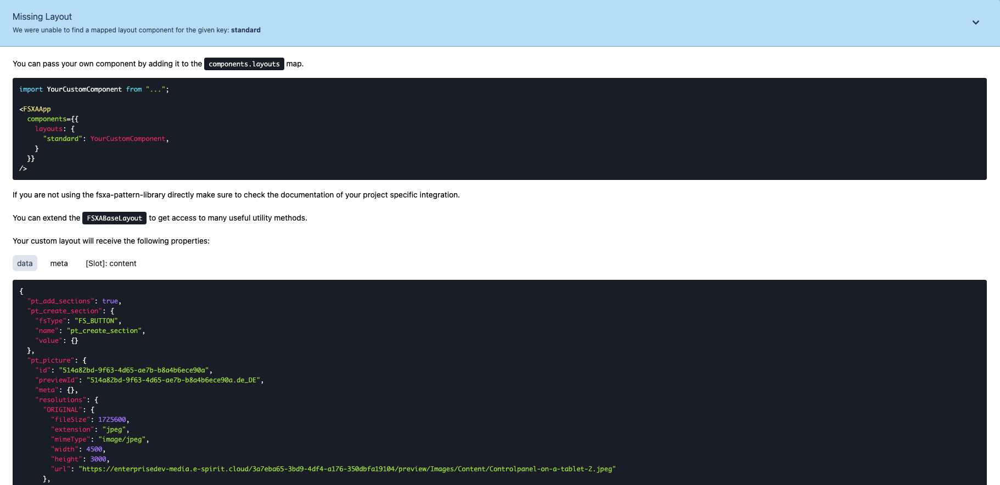

[<< Back to Index](./index.md)

# My First Template

This chapter describes how to set up the project and complete the first steps.

1. [Requirements](#requirements)
2. [Setting up the Project](#setting-up-the-project)
3. [Development Mode](#development-mode)
4. [Writing JSX/TSX Components](./TSX-Components.md)
5. [Writing Single File Components](./SFC-Components.md)

## Requirements

* [node](https://nodejs.org/en/) - latest LTS Version: 14.15.5.
* A text editor - like [VS Code](https://code.visualstudio.com/) with the [Vetur](https://marketplace.visualstudio.com/items?itemName=octref.vetur) plugin.
* A terminal - like VS Code's integrated [terminal](https://code.visualstudio.com/docs/editor/integrated-terminal)
* [Git](https://git-scm.com/) - latest major version: > 2.

## Setting up the Project

1. Open the terminal and if needed, navigate to your preferred directory where the project should be saved.

2. Clone the project using the terminal command `git clone https://github.com/e-Spirit/fsxa-pwa.git`. The project should be downloaded into a folder called `fsxa-pwa`.

3. Navigate to the newly created folder with `cd fsxa-pwa`.

4. Copy the existing `.env.template` file and paste it with the new name `.env` or simply run the command `cp .env.template .env`.

5. The .env file must contain all the information you need to access your own system. You can get this information from your contact at e-Spirit AG. By default, this file is located in the `.gitignore` and is therefore not persisted. Each required attribute is explained briefly, for a more detailed description please check the [configuration page](../Configuration.md).

6. To install the needed dependencies run the command `npm install`.

7. After all dependencies are installed, you can start a local development server with `npm run dev`.

8. After the server is started, it can be accessed at http://localhost:3000 in your browser.

## Development Mode

There is a development mode that helps to easily map the content coming from the [CaaS](https://docs.e-spirit.com/module/caas/CaaS_FSM_Documentation_EN.html).

To enable the development mode, the variable `devMode` must be set to `true` in the `fsxa.config.ts` file. Be aware that you have to restart the server when you change anything in this file. This file is also checked into git. So be sure to change the variable back to `false` before deploying to production.

If you are in development mode and a component on the page has not been developed yet, you will get an info box which shows exactly which component is missing and what information in the component can be addressed.

If you are in development mode and you have already implemented the component, then you will see question marks when hovering over the element.

Clicking on this question mark will provide you with more information about which component is being displayed and what data is available.

## Writing Components

Depending on the language you choose to implement your first Component we have provided two guides to get you started.

If you prefer the classic vue single file component style [this guide](./SFC-Components.md) is for you.

If you come from react and are already familiar with JSX/TSX or you are curious and would like to get started with it [this guide](./TSX-Components.md) is for you.