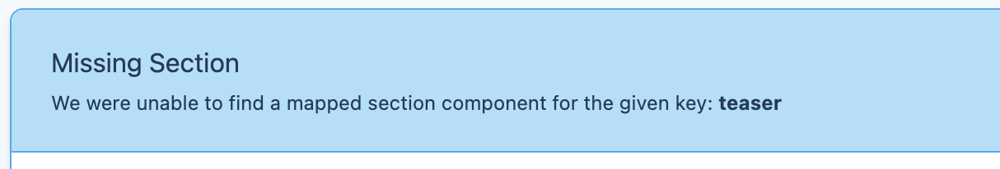

[<< Back to Index](./index.md)

# Writing Single File Components

In this section we will be exploring how to go about implementing a missing Teaser section using the classic vue single file components.

When you go to the home page in the development mode, you will see that one component is missing.



This infobox tells us that the app expects a component of type `Section`. We can also see that the key of this missing section is `teaser`.

In the `fsxa.config.js` file we can see that our section components are located in `~/components/fsxa/sections`.
That's where you want to create a new file for the component.

Make sure you name the file just like the key that is required. In our case it is `teaser` so we name our new file `Teaser.vue`.

Next we need to import the base class that we will derive our class from:

```vue
<script>
  import { FSXABaseSection } from 'fsxa-pattern-library'
</script>
```

With this we can start writing our class.

```javascript
export default {
  name: 'TeaserSection',
  extends: [FSXABaseSection]
}
```

Next we can add a template tag to the file so we can see something when we fire up the dev server.

```vue
<template>
  <div>Hello Component</div>
</template>
```

For the time being our `Teaser.vue` file should look something like this:

```vue
<template>
  <div>Hello Component</div>
</template>
<script>
import { FSXABaseSection } from 'fsxa-pattern-library'
export default {
  name: 'TeaserSection',
  extends: [FSXABaseSection]
}
</script>
```

When we go back to the browser, instead of the infobox we should see our component.


Our component is recognized correctly. But we still do not display the data from the [CaaS](https://docs.e-spirit.com/module/caas/CaaS_FSM_Documentation_EN.html) in our component.
For that we hover over our component and click on the appearing question mark on the right side.


This shows us the data available to display.
For the first example we want to display the `st_jumbo_headline`. Since the payload property is inherited by the `FSXABaseSection` we can now access it as an attribute.

```vue
<template>
  <div>Headline: {{ $attrs.payload.st_jumbo_headline }}</div>
</template>
```

The result should look like this:


In order to display all the payload data, we can use a component from the [fsxa-ui](https://github.com/e-Spirit/fsxa-ui/). We need to import it. It is located under Sections in the fsxa-ui. Since the payload also contains richtext we also need to import FSXARichText from the [fsxa-pattern-library](https://github.com/e-Spirit/fsxa-pattern-library)
Don't forget to register the imported components.

```javascript
import { Sections } from 'fsxa-ui'
import { FSXABaseSection, FSXARichText } from 'fsxa-pattern-library'
export default {
  name: 'TeaserSection',
  components: {
    'teaser-section': Sections.TeaserSection,
    'rich-text': FSXARichText
  },
  extends: [FSXABaseSection]
}
```

Using them in our template is slightly more complicated than in the TSX example. So we will gradually build it up. We'll start off by passing only the required props.

```vue
<template>
  <teaser-section 
    kicker="Some kicker text" 
    headline="This is a headline"
    text="So here is a lot of text" />
</template>
```

Using this example we can pass simple strings into the props and the `teaser-section` component will render these for us. But the kicker and the headline in the payload contain richtext, which we will render using the `FSXARichText` component. Since we can't pass components into props we will have to resort to [scopedSlots](https://vuejs.org/v2/guide/components-slots.html#Scoped-Slots)

First, let's extend the above example by rendering the headline in our own custom way using scoped slots.

```vue
<template>
  <teaser-section 
    kicker="Some kicker text" 
    headline="This is a headline"
    text="So here is a lot of text">
    <template v-slot:headline="customHeadline">
      <h1 style="color: tomato">
        {{ customHeadline }}
      </h1>
    </template>
  </teaser-section>
</template>
```

As you can see we extended the `teaser-section` tag to also use an enclosing tag and added another `template` tag. Using the v-slot directive we can choose which slot the template represents. What we pass into the v-slot directive can be any string. We basically declare a variable at this point which represents the data we passed into the `headline` prop. We use the variable inside the `h1` tag where it will render as "this is a headline".

Now let's see what this looks like when we add our payload data.

```vue
<template>
  <teaser-section
    :kicker="this.$attrs.payload.st_kicker"
    :headline="this.$attrs.payload.st_headline"
    :text="this.$attrs.payload.st_text"
  >
    <template v-slot:headline="headline">
      <rich-text :content="headline" />
    </template>
    <template v-slot:text="text">
      <rich-text :content="text" />
    </template>
  </teaser-section>
</template>
```

Note how we replaced all props with bindings to the payload data. We also use a second template tag, representing the text slot. Inside the templates we use `FSXARichText` components (which we named `rich-text`) to render the rich text data from the `st_text` and `st_headline` properties.

Next let's add our image. The prop `media` asks for an object with the following properties: `type`,`src`,`resolutions`,`previewId`. For readability we should construct this object in a function and simply call the function when we bind the prop in the template. We add a `methods` property to our vue object and define the function there.

```vue
<template>
  <teaser-section
    :kicker="this.$attrs.payload.st_kicker"
    :headline="this.$attrs.payload.st_headline"
    :text="this.$attrs.payload.st_text"
    :media="getMedia()"
  >
    <template v-slot:headline="headline">
      <rich-text :content="headline" />
    </template>
    <template v-slot:text="text">
      <rich-text :content="text" />
    </template>
  </teaser-section>
</template>
<script>
export default {
  name: 'TeaserSection',
  components: {
    'teaser-section': Sections.TeaserSection,
    'rich-text': FSXARichText
  },
  extends: [FSXABaseSection],
  methods: {
    getMedia() {
      if (this.$attrs.payload.st_picture) {
        return {
          type: 'image',
          src: this.$attrs.payload.st_picture.resolutions.ORIGINAL.url,
          resolutions: this.$attrs.payload.st_picture.resolutions,
          previewId: this.$attrs.payload.st_picture.previewId
        }
      } else {
        return undefined
      }
    }
  }
}
</script>
```

Finally we add the button. This one is a bit more complicated. We first need to define a button label and then a handler for a click on the button. 

The label is fairly straightforward. First, we add another function to the `methods` property.

```javascript
methods: {
  getButtonText() {
    return this.$attrs.payload.st_button
      ? this.$attrs.payload.st_button.data.lt_button_text
      : undefined
  },
  ...
}
```

And then we call the function in our template

```vue
<template>
  <teaser-section
    :kicker="this.$attrs.payload.st_kicker"
    :headline="this.$attrs.payload.st_headline"
    :text="this.$attrs.payload.st_text"
    :button-text="getButtonText()"
    :media="getMedia()"
  >
  ...
```

For the click handler the TeaserSection component itself emits an event called `buttonClick` when the button is clicked. We can simply add an event handler to our template. First we define the function `handleButtonClick`

```javascript
  methods: {
    getButtonText() {
      return this.$attrs.payload.st_button
        ? this.$attrs.payload.st_button.data.lt_button_text
        : undefined
    },
    handleButtonClick() {
      const pageId = this.$attrs.payload.st_button
        ? this.$attrs.payload.st_button.data.lt_internal.referenceId
        : undefined
      this.$options.parent.triggerRouteChange({
        pageId
      })
    },
    ...
  }
```

And then we pass it to our template. We can use the `@` shorthand to define an event handler.

```vue
<template>
  <teaser-section
    :kicker="this.$attrs.payload.st_kicker"
    :headline="this.$attrs.payload.st_headline"
    :text="this.$attrs.payload.st_text"
    :button-text="getButtonText()"
    :media="getMedia()"
    @buttonClick="handleButtonClick"
  >
  ...
```

When you put everything together your final `Teaser.vue` file should look like this:

```vue
<template>
  <teaser-section
    :kicker="this.$attrs.payload.st_kicker"
    :headline="this.$attrs.payload.st_headline"
    :text="this.$attrs.payload.st_text"
    :button-text="getButtonText()"
    :media="getMedia()"
    @buttonClick="handleButtonClick"
  >
    <template v-slot:headline="headline">
      <rich-text :content="headline" />
    </template>
    <template v-slot:text="text">
      <rich-text :content="text" />
    </template>
  </teaser-section>
</template>
<script>
import { FSXABaseSection, FSXARichText } from 'fsxa-pattern-library'
import { Sections } from 'fsxa-ui'

export default {
  name: 'TeaserSection',
  components: {
    'teaser-section': Sections.TeaserSection,
    'rich-text': FSXARichText
  },
  extends: [FSXABaseSection],
  methods: {
    getButtonText() {
      return this.$attrs.payload.st_button
        ? this.$attrs.payload.st_button.data.lt_button_text
        : undefined
    },
    handleButtonClick() {
      const pageId = this.$attrs.payload.st_button
        ? this.$attrs.payload.st_button.data.lt_internal.referenceId
        : undefined
      this.$options.parent.triggerRouteChange({
        pageId
      })
    },
    getMedia() {
      if (this.$attrs.payload.st_picture) {
        return {
          type: 'image',
          src: this.$attrs.payload.st_picture.resolutions.ORIGINAL.url,
          resolutions: this.$attrs.payload.st_picture.resolutions,
          previewId: this.$attrs.payload.st_picture.previewId
        }
      } else {
        return undefined
      }
    }
  }
}
</script>
```
