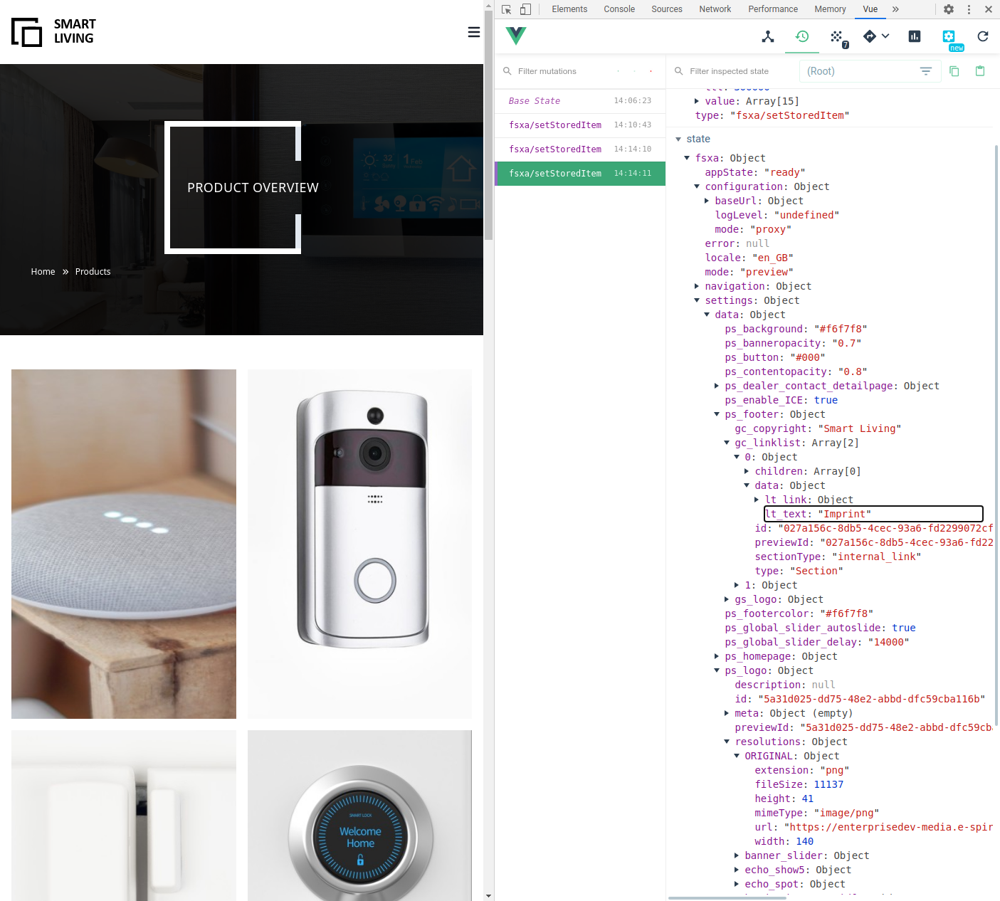

# Project Properties

[<< Back to index](./index.md)

FirstSpirit provides a mechanism to configure _global project settings_ in a specific area of the project data. In the **FirstSpirit SiteArchitect** this **Global settings** area is presented as the 'gray' section found behind the cog wheels.


In the FSXA example project [Smart Living Global](https://docs.e-spirit.com/module/fsxa/developer-dokum/fsxa-javascript/components/smart_living_global_1) a "Theming" tab allows you to quickly modify *project settings* such as `button color`, `text highlighting color` or `banner opacity`.

### Reading a single value

When developing a PWA the _global settings_ can be a accessed from any FSXABaseCompenent element via the _globalSettings()_ attribute. This way reading the text highlight color value from the Smart Living Global project is as simple as doing:

```javascript
import { FSXABaseAppLayout } from 'fsxa-pattern-library'
class AppLayout extends FSXABaseAppLayout {
  render() {
    <div>Color: {this.globalSettings?.data.ps_text_highlighting}</div>
    )
  }
}
export default AppLayout
```

The key `ps_text_highlighting` is the input field name defined in *Smart Living Global*'s project settings template (UID: `project_settings`):

```xml
<CMS_INPUT_TEXT name="ps_text_highlighting" hFill="yes" singleLine="no" useLanguages="no">
    <LANGINFOS>
        <LANGINFO lang="*" label="Text-Highlighting color"/>
        <LANGINFO lang="DE" label="Text-Highlighing Farbe"/>
    </LANGINFOS>
</CMS_INPUT_TEXT>
```

### Reading a list of values

In *Smart Living Global* you see two links in each page's footer:

```
Imprint  Privacy Policy
```

Both are defined in the global settings (in both project languages), and stored via an FS_CATALOG input component.

Now the way we render *all* the links in Smart Living Global's AppLayout component is by looping over the linklist with `.map()`:

```javascript
{this.globalSettings?.data.gc_linklist.map((link: any) => (
              <nuxt-link
                to={this.getUrlByPageId(link.data.lt_link.referenceId) || '#'}
                class={`tw-text-xs hover:tw-underline`}
              >
                {link.data.lt_text}
              </nuxt-link>
            ))}
```
### Finding out about available attributes

Provided you have the [Vue Devtools](https://github.com/vuejs/vue-devtools) installed, you can easily analize the settings object's attributes from your web browser:



### Further information

You can find further information on _Global settings_ in the [Online Documentation FirstSpirit](https://docs.e-spirit.com/odfs/edocs/fsar/global-settings/).