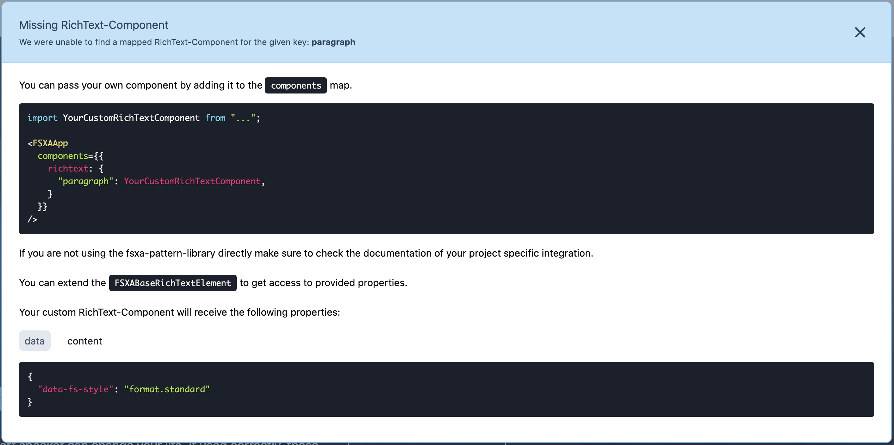

[<< Back to Index](./index.md)

# Working with RichText

RichText allows you to display information in the FirstSpirit context using great and customisable formatting. This brings with it a certain complexity.

To counteract this, we have extended our automatism so that it not only loads layouts and sections, but also RichText components. In order for your component to be loaded automatically, you must place a file corresponding to the [naming scheme](Configuration.md#components) in your [configured](Configuration.md#richtext) richtext folder.

> We recommend that you derive from the [`FSXABaseRichTextElement`](components/FSXABaseRichTextElement.md). This base class provides properties that are already mapped along with useful helper functions, such as rendering child nodes.

In our fsxa-pwa sample project we have already included some sample components, which you can of course use, adapt or extend. In the course of time, however, it may happen that you use formatting that does not yet have a frontend component as a counterpart or that you adapt existing formatting.

If the [DevMode](DevMode.md) is activated, useful information about RichText components that are still missing is displayed.


Clicking on it will show you further information about the missing component.



And finally, clicking the content tab in the info window will reveal all of the data that will be passed into your component.

```json
[
  {
    "data": {
      "data-fs-style": "format.standard"
    },
    "content": [
      {
        "type": "text",
        "content": "Life made ",
        "data": {}
      },
      {
        "data": {
          "data.fs-style": "format.span_yellow_text"
        },
        "content": [
          {
            "type": "text",
            "content": "easier",
            "data": {}
          }
        ],
        "type": "paragraph"
      }
    ],
    "type": "paragraph"
  }
]
```
