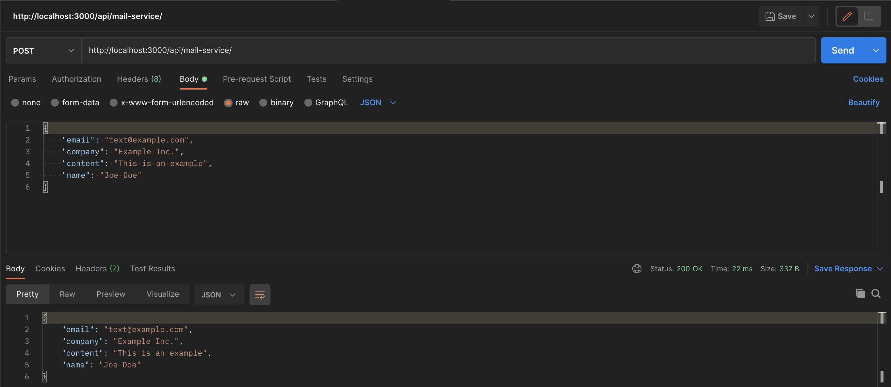

# Sending Mails

In this chapter you will implement a REST-API, that can send emails.
For this purpose, you will use the FSXA-PWA Project to add a new route and implement it with [Nodemailer](https://github.com/nodemailer/nodemailer).

In this example we will implement a contact form where we take information such as the name, email, company name and message
and send it in an email.

Please note the general preface, how to define CustomRoutes.

As a starting point we have a file named `mailService.ts` with the content

```typescript
import express, { Request, Response } from 'express'
// eslint-disable-next-line import/named
import { FSXAMiddlewareContext } from 'fsxa-nuxt-module'

export default {
  async handler(
    context: FSXAMiddlewareContext,
    request: Request,
    response: Response
  ) {
    const app = express()
    app.use(express.json())

    return app(request, response)
  },
  route: '/mailService/'
}
```

First, you want to create a new endpoint that will receive the required data when a POST-Request is made. To keep it simple exactly sends back again.

To do this, after the express app has been initalized,
you create a new POST endpoint and send the body back when you get it.

```typescript
app.post('/', (req, res) => {
  res.send(req.body)
})
```

And when you try this in Postman, you get the corresponding result.



First of all you want to make sure that you really get a name, an email, a company name and a message for each request and you want to check if the email that was given can be correct at all.

You destructure the body of the request and take the values, expected to be present there.

```typescript
const { email, subject, company, content } = req.body
```

Next you want to check if all values are set and if they are not, you send the status code 422 (Unprocessable Entity) with a corresponding error message. You should make sure with the `return` that the code is not continued here, since you have already sent the message.

```typescript
if (!email || !subject || !company || !content) {
  return res.status(422).send({
    code: 422,
    message: 'Please provide email, subject, company and content'
  })
}
```

You can also outsource this logic to a separate method, which can make the logic in the request look cleaner . This is what you do in the next example, where you check if the email is valid.

For this you write **over** the `export default` a new method that is called `isEmailValid` which takes a string.

```typescript
const isEmailValid = (email: string) => {
  return email.includes('@')
}
```

There you will check if the email also contains an @ sign. It is kept simple, but this method can be extended very conveniently afterwards.

Now you can include the method in our POST request and if no valid email is provided, issue an error message.

```typescript
if (!isEmailValid(email)) {
  return res
    .status(422)
    .send({ code: 422, message: 'Please provide a valid email' })
}
```

You can try this again and see that if you specified an email without an @ sign, this exact error message appears.

But now you can take that information and finally send an email.

For this you use the library [Nodemailer](https://www.npmjs.com/package/nodemailer). In this example we cannot go into all the possibilities and features of Nodemailer. If you are interested, we recommend a look at the [Documentation](https://nodemailer.com/about/).

First you install nodemailer via npm.

```bash
npm install nodemailer @types/nodemailer
```

and import it at the top in the `mailService.ts` data

```bash
import nodemailer from 'nodemailer'
```

Nodemailer offers the possibility to create a test account together with [ethereal.email](https://ethereal.email/). This is what you will do in this example. You could use your own account for this, just make sure not to make your credentials public.

You create a new method to send the email. In this method we create the test account and the transporter where we connect to the SMTP server.

```typescript
const sendMail = async (mailContent: MailContent) => {
  const testAccount = await nodemailer.createTestAccount()
  const transporter = nodemailer.createTransport({
    host: 'smtp.ethereal.email',
    port: 587,
    secure: false,
    auth: {
      user: testAccount.user,
      pass: testAccount.pass
    }
  })
}
```

With this transporter you can now call a method to send an email.
There you can specify the sender, the recipient, the subject and the content of the email.
You can add this directly after creating the `transporter`.

```typescript
const info = await transporter.sendMail({
  from: '"Sending Test Account" <sender@example.com>',
  to: 'Receiving Test Account <receiver@example.com> ',
  subject: 'Testing Mail',
  text: 'Hello World',
  html: '<h1>Hello World</h1>'
})
return info
```

Here you can specify `text` **and** `html`. The `text` serves as a fallback in case an email provider does not support HTML.

You can now call the `sendMail` method in your controller:

```typescript
sendMail({ email, subject, company, content })
  .then((info) => {
    console.log(nodemailer.getTestMessageUrl(info))
    res.send(info)
  })
  .catch((err) => {
    res
      .status(err.responseCode || 400)
      .send({ code: err.responseCode || 400, err })
  })
```

If the sending of the email was successful, you have the possibility with `Nodemailer` to let you print the URL with the message. The information will also be sent back as a response to the request. <br />
If the sending of the email is not successful, the corresponding status code, or if it does not exist `400`, and the error message should be sent back.

If you open the URL that was logged out in the console in the browser, you will see the message that was sent.

Now we want to add our own content to this email.
For this we first create an `interface` in which we say which content we want to use:

```typescript
interface MailContent {
  email: string
  subject: string
  company: string
  content: string
}
```

Next, we create two functions that will create text using the parameters, one as plain text and one as email.

```typescript
const generateText = ({ email, subject, company, content }: MailContent) => {
  return `
NEW MESSAGE RECEIVED
Data:
Subject: ${subject}
Email: ${email}
Company: ${company}
Content: ${content}
`
}

const generateHTML = ({ email, subject, company, content }: MailContent) => {
  return `
  <h1>NEW MESSAGE RECEIVED</h1>
  <p>Data: 
  <ul>
    <li>Email: ${email}</li>
    <li>Subject: ${subject}</li>
    <li>Company: ${company}</li>
    <li>Content: <pre>${content}</pre></li>
  </ul>
  </p>
`
}
```

In our `sendMail` function we can now also pass the content and use our created functions.

```typescript
const sendMail = async (mailContent: MailContent) => {
  const testAccount = await nodemailer.createTestAccount()
  const transporter = nodemailer.createTransport({
    host: 'smtp.ethereal.email',
    port: 587,
    secure: false,
    auth: {
      user: testAccount.user,
      pass: testAccount.pass
    }
  })
  const info = await transporter.sendMail({
    from: '"Sending Test Account" <sender@example.com>',
    to: 'Receiving Test Account <receiver@example.com> ',
    subject: 'Test',
    text: generateText(mailContent),
    html: generateHTML(mailContent)
  })
  return info
}
```

The whole file should look like this in the end:

```typescript
import express, { Request, Response } from 'express'
// eslint-disable-next-line import/named
import { FSXAMiddlewareContext } from 'fsxa-nuxt-module'
import nodemailer from 'nodemailer'

interface MailContent {
  email: string
  subject: string
  company: string
  content: string
}

const generateText = ({ email, subject, company, content }: MailContent) => {
  return `
NEW MESSAGE RECEIVED
Data:
Subject: ${subject}
Email: ${email}
Company: ${company}
Content: ${content}
`
}

const generateHTML = ({ email, subject, company, content }: MailContent) => {
  return `
  <h1>NEW MESSAGE RECEIVED</h1>
  <p>Data: 
  <ul>
    <li>Email: ${email}</li>
    <li>Subject: ${subject}</li>
    <li>Company: ${company}</li>
    <li>Content: <pre>${content}</pre></li>
  </ul>
  </p>
`
}

const sendMail = async (mailContent: MailContent) => {
  const testAccount = await nodemailer.createTestAccount()
  const transporter = nodemailer.createTransport({
    host: 'smtp.ethereal.email',
    port: 587,
    secure: false,
    auth: {
      user: testAccount.user,
      pass: testAccount.pass
    }
  })
  const info = await transporter.sendMail({
    from: '"Sending Test Account" <sender@example.com>',
    to: 'Receiving Test Account <receiver@example.com> ',
    subject: 'Test',
    text: generateText(mailContent),
    html: generateHTML(mailContent)
  })
  return info
}

const isEmailValid = (email: string) => {
  return email.includes('@')
}

export default {
  async handler(context: FSXAMiddlewareContext, req: Request, res: Response) {
    const app = express()
    app.post('/', async (req, res) => {
      const { email, subject, company, content } = req.body
      if (!email || !subject || !company || !content) {
        return res.status(422).send({
          code: 422,
          message: 'Please provide email, subject, company and content'
        })
      }
      if (!isEmailValid(email)) {
        return res
          .status(422)
          .send({ code: 422, message: 'Please provide a valid email' })
      }

      sendMail({
        email,
        subject,
        company,
        content
      })
        .then((info) => {
          console.log(nodemailer.getTestMessageUrl(info))
          res.send(info)
        })
        .catch((err) => {
          res
            .status(err.responseCode || 400)
            .send({ code: err.responseCode || 400, err })
        })
    })
    return app(req, res)
  },
  route: '/mailService/'
}
```
